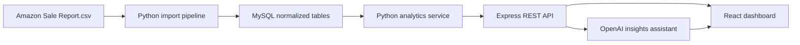

# AI-Powered Sales & Revenue Analytics Platform

Production-style internship project that turns Amazon sales data into normalized MySQL records, analytics KPIs, ML forecasts, and grounded AI insight answers.

## Stack

- Frontend: HTML, CSS, JavaScript, React CDN, Chart.js
- Backend: Node.js, Express, JWT, bcrypt, MySQL
- Database: MySQL normalized schema
- Data and ML: Python, Pandas, NumPy, Scikit-learn Linear Regression
- AI: OpenAI API with data-grounded context
- Real-time: Socket.io live order updates
- Deployment: Vercel frontend, Render/Railway backend and Python service, cloud MySQL

## Architecture



Data flow: MySQL stores users, products, orders, and order items. The Python service reads MySQL, cleans invalid rows, computes revenue, aggregates monthly/category/product metrics, and trains the forecast model. The Express API authenticates users, calls the Python service for `/analytics` and `/predict`, and passes summary statistics to OpenAI for `/chat`. Socket.io broadcasts `order:created` when an admin inserts an order through the API, and dashboards refresh live. The frontend calls Express only, so secrets and database credentials never reach the browser.

## Quick Start

1. Copy `.env.example` to `backend/.env` and `python_service/.env`.
2. Download dataset from:
[<your-link>](https://www.kaggle.com/datasets/thedevastator/unlock-profits-with-e-commerce-sales-data?resource=download)
3. Create schema and demo records:

```bash
mysql -u root -p < database/schema.sql
mysql -u root -p < database/seed.sql
```

3. Import the Amazon dataset:

```bash
cd python_service
python -m venv .venv
.\.venv\Scripts\activate
pip install -r requirements.txt
python import_amazon_sales.py --csv "D:\Trigent_internship\Amazon Sale Report.csv"
```

4. Start services:

```bash
uvicorn app:app --reload --port 8000
cd ..\backend
npm install
npm run dev
```

5. Open `frontend/index.html`. Demo login after seed: `admin@example.com` / `Password@123`.

For frontend live updates, serve the frontend folder instead of opening it as `file://`:

```bash
cd frontend
python -m http.server 3000
```

Open `http://localhost:3000`.

## Project Structure

```text
backend/          Express API, auth, routes, OpenAI integration
database/         MySQL schema and seed scripts
python_service/   FastAPI analytics, data pipeline, ML forecast, CSV importer
frontend/         Static React dashboard and AI chat UI
docs/             Architecture, API, deployment, ML, and business notes
```

## Standout Features

- Admin dashboard: full analytics, all recent orders, all users, CSV export, and demo order insertion.
- User dashboard: only that user's own orders and personalized analytics/AI context.
- Real-time updates: Socket.io refreshes dashboards when a new order is created through `/orders`.
- Explainable ML: forecast response explains the predicted direction and shows simple feature importance for `month_index`.
